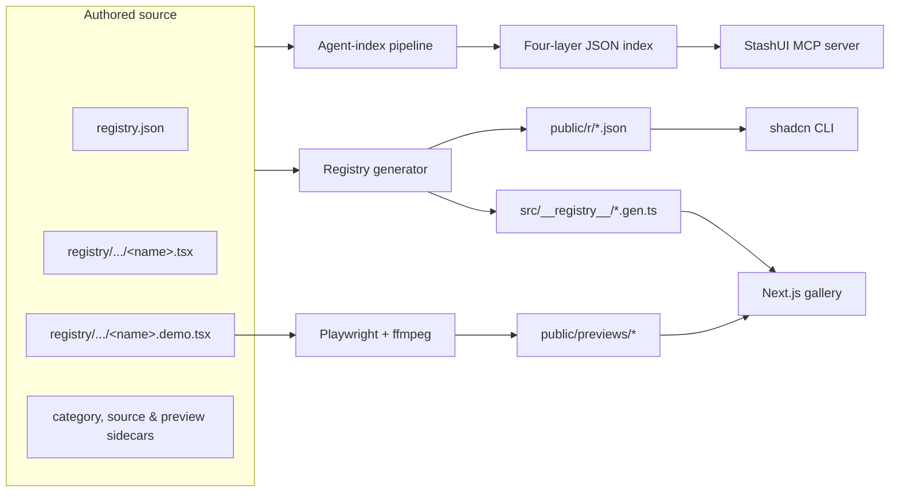

<div align="center">

# StashUI

**1,518 React components. One visual gallery. One agent-friendly registry.**

Browse, preview, copy, and install shadcn-style components—or let an AI agent
navigate the same library through a purpose-built MCP server.

[](https://stashui.vercel.app/)
[](https://stashui.vercel.app/)
[](https://nextjs.org/)
[](https://react.dev/)
[](#use-stashui-with-an-ai-agent)
[](LICENSE)

[Explore the gallery](https://stashui.vercel.app/) ·
[Install a component](#install-a-component) ·
[Connect an agent](#use-stashui-with-an-ai-agent) ·
[Understand the architecture](#architecture)

</div>

---

StashUI is an open component library built for two kinds of discovery:

- **Humans** use the StashUI gallery to browse categories, search with
  <kbd>⌘ K</kbd>, watch lightweight previews, inspect live components, copy
  source, and get an install command.
- **Agents** use the StashUI MCP server to reason through a four-layer index,
  compare candidates, inspect their APIs and integration cost, and install a
  whole screen in one command.

The components follow the shadcn model: source code is installed into your
project and becomes yours to edit. StashUI is a registry and discovery system,
not a runtime UI package.

## Start here

| I want to… | Go to |
| --- | --- |
| Browse the catalogue | [Open the live gallery](https://stashui.vercel.app/) |
| Add one component to my app | [Install a component](#install-a-component) |
| Run or contribute to StashUI | [Run the gallery locally](#run-the-gallery-locally) |
| Let an agent choose components | [Set up the MCP server](#use-stashui-with-an-ai-agent) |
| Understand how data is generated | [Read the architecture](#architecture) |
| Add a registry component | [Follow the contributor workflow](#add-or-update-a-component) |

## Why StashUI?

- **A large, organized catalogue** — 1,518 components across 31 practical
  categories, from buttons and forms to backgrounds, effects, navigation, and
  data display.
- **Real previews** — fast video loops in the gallery and live, responsive,
  interactive previews on every component page.
- **One-command installation** — install through the shadcn CLI, including npm
  packages, registry dependencies, CSS variables, and keyframes declared by the
  component.
- **Framework-conscious source** — the registry records React and Next.js
  compatibility and warns when a component introduces a Next-only import.
- **Agent-native retrieval** — MCP tools narrow the catalogue before loading
  detailed prose or source code, keeping discovery focused and auditable.
- **Inspectable generation** — the gallery, installable JSON, previews, and
  agent index all trace back to files committed in this repository.

## Install a component

### 1. Prepare a shadcn project

Use an existing shadcn project, or initialize one first:

```bash
npx shadcn@latest init
```

### 2. Pick and install

Browse [stashui.vercel.app](https://stashui.vercel.app/), open a component, and
copy its install command. For example:

```bash
npx shadcn@latest add https://stashui.vercel.app/r/shimmer-button.json
```

The CLI writes the component into your configured components directory and
installs anything declared by its registry item.

### 3. Import it

```tsx
import { ShimmerButton } from "@/components/ui/shimmer-button";

export function SaveAction() {
  return <ShimmerButton>Save changes</ShimmerButton>;
}
```

> [!TIP]
> You can pass several registry URLs to one `shadcn add` command. The
> `stashui_install` MCP tool prepares that combined command automatically and
> includes the shadcn primitives the selected components import.

## Run the gallery locally

### Requirements

- [Node.js](https://nodejs.org/) 20 or newer
- npm
- Python 3 when rebuilding the agent index
- Optional: Playwright and `ffmpeg` when recording preview videos

### Setup

```bash
git clone https://github.com/vermarjun/StashUI.git
cd StashUI
npm install
npm run dev
```

Open [http://localhost:3000](http://localhost:3000). No environment variables
are required for the gallery or MCP server.

### Useful commands

| Command | Purpose |
| --- | --- |
| `npm run dev` | Start the Next.js development server |
| `npm run build` | Create a production gallery build |
| `npm run start` | Serve the production build |
| `npm run lint` | Run ESLint |
| `npm run typecheck` | Run TypeScript without emitting files |
| `npm run registry` | Rebuild gallery data, installable JSON, and the agent index |
| `npm run index` | Rebuild only the agent index |
| `npm run mcp:build` | Compile the MCP server |
| `npm run capture -- <name>` | Record one component's grid preview |
| `npm run capture:category -- <slug>` | Record every preview in a category |
| `npm run previews` | Regenerate the preview manifest |

## Use StashUI with an AI agent

The gallery is optimized for people. The local MCP server is optimized for
agents that need to choose among 1,518 components without loading the entire
catalogue into context.

### Build the MCP server

From a cloned StashUI repository:

```bash
npm --prefix mcp install
npm run mcp:build
```

You will point your MCP client at this generated entry file:

```text
/absolute/path/to/StashUI/mcp/dist/index.js
```

Always use an absolute path. The server uses stdio, runs entirely on your
machine, and needs no API key.

### Connect Codex

The shortest setup is the Codex CLI:

```bash
codex mcp add stashui -- node /absolute/path/to/StashUI/mcp/dist/index.js
codex mcp list
```

Or add it to `~/.codex/config.toml` (global) or `.codex/config.toml`
(project-scoped):

```toml
[mcp_servers.stashui]
command = "node"
args = ["/absolute/path/to/StashUI/mcp/dist/index.js"]
```

Restart Codex after editing configuration, then use `/mcp` to confirm that the
server and its tools are available. See the
[official Codex MCP documentation](https://learn.chatgpt.com/docs/extend/mcp?surface=cli)
for the full configuration reference.

### Connect Claude Code

Add it from the repository where you want to use the components:

```bash
claude mcp add stashui --scope project -- node /absolute/path/to/StashUI/mcp/dist/index.js
claude mcp list
```

This writes a shareable `.mcp.json`. You can also create it yourself:

```json
{
  "mcpServers": {
    "stashui": {
      "command": "node",
      "args": ["/absolute/path/to/StashUI/mcp/dist/index.js"]
    }
  }
}
```

Claude Code asks for approval before it uses a project-scoped server. See
[Anthropic's MCP guide](https://docs.anthropic.com/en/docs/claude-code/mcp) for
user and local scopes.

### Connect Cursor or Claude Desktop

Add the same `mcpServers` object above to:

- Cursor: `.cursor/mcp.json` in a project, or the global `mcp.json` opened from
  **Cursor Settings → Tools & MCP**.
- Claude Desktop: `claude_desktop_config.json`, opened from
  **Settings → Developer → Edit Config**.

Restart the client after saving. Cursor's current transport and configuration
options are documented in its
[MCP guide](https://docs.cursor.com/context/model-context-protocol).

### Connect VS Code

VS Code uses `servers` rather than `mcpServers`. Create `.vscode/mcp.json`:

```json
{
  "servers": {
    "stashui": {
      "type": "stdio",
      "command": "node",
      "args": ["/absolute/path/to/StashUI/mcp/dist/index.js"]
    }
  }
}
```

See the [VS Code MCP configuration reference](https://code.visualstudio.com/docs/agents/reference/mcp-configuration)
for workspace and user-level alternatives.

### Custom index location

The server normally finds `agent-index/index` relative to its compiled file. If
you move or package the server separately, set `STASHUI_INDEX` to the directory
that contains `categories.json`:

```json
{
  "mcpServers": {
    "stashui": {
      "command": "node",
      "args": ["/absolute/path/to/StashUI/mcp/dist/index.js"],
      "env": {
        "STASHUI_INDEX": "/absolute/path/to/StashUI/agent-index/index"
      }
    }
  }
}
```

### Verify with MCP Inspector

```bash
npm --prefix mcp run inspect
```

The inspector should show six tools whose names begin with `stashui_`.

## How agents discover components

StashUI uses **navigation, not embedding search**. An agent moves from a small
map of the library toward detail only when detail is useful:

| Stage | MCP tool | Question it answers |
| --- | --- | --- |
| Layer 1 | `stashui_categories()` | Which category should I inspect? |
| Layer 2 | `stashui_category(slug, filters)` | Which components fit the need? |
| Layer 3 | `stashui_component(name)` | Is this the right component? |
| Layer 4 | `stashui_code(name)` | How is it implemented? |

Two task-oriented tools sit across those layers:

| Tool | Use it for |
| --- | --- |
| `stashui_slot(slot)` | Find candidates for a page slot across all categories |
| `stashui_install(names[])` | Produce one complete shadcn install command |

The category tool can filter by interaction trigger, visual tone, page slot,
dependency count, and whether the component contains hardcoded colors. Filters
run before the agent reads the candidate list.

### Recommended agent workflow

```text
1. stashui_categories()
2. stashui_category("buttons", trigger="hover", tone="minimal", clean_only=true)
3. stashui_component("shimmer-button")
4. Compare two or three finalists; read ALTERNATIVES when present.
5. stashui_code("shimmer-button") only if implementation details matter.
6. stashui_install(["aurora-background", "shimmer-button", "bento-grid"])
```

An effective prompt is:

> Use the StashUI MCP server to find a minimal, touch-friendly primary CTA.
> Navigate from categories to a shortlist, compare the finalists, and return one
> install command. Prefer no hardcoded colors and as few dependencies as
> possible.

See [mcp/README.md](mcp/README.md) for the server-focused guide and
[agent-index/spec/SCHEMA.md](agent-index/spec/SCHEMA.md) for every field exposed
at each layer.

## Architecture

There is one authored source of truth. Everything used by the gallery, shadcn,
and MCP is generated from it.



### Project layers

| Layer | Location | Responsibility |
| --- | --- | --- |
| Component source | `registry.json`, `registry/` | Components, demos, dependencies, categories, attribution, and preview configuration |
| Registry generation | `scripts/build-registry.mjs` | Validates portability and generates gallery-safe data |
| Install registry | `public/r/*.json` | Static shadcn registry items consumed by `shadcn add` |
| Human experience | `src/app/`, `src/components/site/` | Search, category browsing, detail pages, code display, and responsive previews |
| Preview pipeline | `scripts/capture*.mjs`, `scripts/captures/` | Records interaction choreography and emits optimized grid media |
| Agent index | `agent-index/` | Builds validated category and component projections for reasoning |
| MCP interface | `mcp/` | Exposes the index as six stdio tools |

### Generated files

Do not edit these by hand:

```text
src/__registry__/registry.gen.ts   full source and demo code; server-only
src/__registry__/meta.gen.ts       lightweight client-safe catalogue
src/__registry__/demos.gen.ts      component name → lazy demo component
src/__registry__/previews.gen.ts   client-safe preview manifest
public/r/*.json                    installable shadcn registry items
agent-index/index/                 files served by the MCP server
```

## Preview system

The project intentionally uses two different preview modes:

- **Explore cards** show muted, looped, accelerated video. An intersection
  observer only plays visible clips. Components without a usable capture fall
  back to a live iframe.
- **Detail pages** render the real interactive demo inside a fixed preview box.
  Mobile, tablet, and desktop controls change the iframe viewport so the
  component reflows normally instead of being transform-scaled.

Optional per-component files tune the experience:

```text
registry/<category>/<name>.preview.json   frame, device, scroll, and capture settings
scripts/captures/<name>.mjs               Playwright interaction choreography
```

To record one preview, keep the dev server running in one terminal:

```bash
npm run dev
```

Then run in another:

```bash
npm run capture -- shimmer-button
npm run previews
```

Preview capture requires `ffmpeg` and Playwright's Chromium browser. Install the
browser once with `npx playwright install chromium`.

## Add or update a component

1. Add the component and its real usage demo:

   ```text
   registry/buttons/my-component.tsx
   registry/buttons/my-component.demo.tsx
   ```

2. Add one item to `registry.json` with its name, title, description, files,
   npm dependencies, registry dependencies, and any CSS or CSS variables.
3. Add or update its category in `registry/categories.json`. Attribution and
   display-title overrides live in `registry/sources.json` and
   `registry/titles.json` when needed.
4. Optionally add a `.preview.json` sidecar and capture choreography.
5. Rebuild all derived data:

   ```bash
   npm run registry
   ```

6. Verify the project:

   ```bash
   npm run lint
   npm run typecheck
   npm run build
   ```

### Component portability rules

Registry components must work in plain React/Vite and Next.js:

- Import only `@/lib/utils`, shadcn primitives, and declared npm dependencies.
- Do not import from `next/*`; use Radix's `asChild` pattern for links and plain
  `` elements for images.
- Keep `"use client"` when hooks or state require it; it is harmless outside
  Next.js.
- Read `window` and `document` only inside effects or behind a mounted guard.
- Prefer theme tokens such as `bg-background`, `text-muted-foreground`, and
  `border-border` over hardcoded colors.
- Declare required keyframes and theme variables in the component's
  `registry.json` item so installed code is self-contained.

The registry generator scans imports and reports framework compatibility
warnings during `npm run registry`.

## Repository map

```text
StashUI/
├── registry.json              shadcn registry manifest
├── registry/                  component source, demos, and sidecars
├── src/                       Next.js gallery
│   └── __registry__/          generated gallery modules
├── public/r/                  generated installable registry items
├── public/previews/           generated grid videos and posters
├── scripts/                   registry and preview tooling
├── agent-index/               retrieval data, schema, and build pipeline
├── mcp/                       local TypeScript MCP server
├── design-grill/              optional design-document skill
└── ship-interface/            optional end-to-end interface skill
```

The two included skills complement MCP:

- [`design-grill`](design-grill/SKILL.md) turns product constraints into a
  human-readable design document and machine-readable design tokens.
- [`ship-interface`](ship-interface/SKILL.md) turns that document into page
  slots, selects components through MCP, installs them, recolors them to the
  tokens, and verifies the result.

## Contributing

Issues and pull requests are welcome. For component changes, include a demo that
shows real content and interactions—not an empty `<Component />` placeholder.
Keep generated files in sync and run the verification commands before opening a
pull request.

When importing work from another component library, record its provenance in
`registry/sources.json`; the gallery uses that metadata to credit the source.

## Deployment

The gallery is a standard Next.js app and can be deployed to Vercel. After
deployment, each generated registry item is available at:

```text
https://<your-domain>/r/<component-name>.json
```

Those public URLs are what make `npx shadcn@latest add ...` work for other
projects.

## Documentation

- [MCP server guide](mcp/README.md)
- [Agent-index design](agent-index/README.md)
- [Index schema and field ownership](agent-index/spec/SCHEMA.md)
- [Index generation contract](agent-index/spec/PROMPT.md)

## Acknowledgements

StashUI builds on [shadcn](https://ui.shadcn.com/), React, Next.js, Tailwind CSS,
Radix UI, and the many component authors credited by the gallery's source
metadata.

## License

StashUI is available under the [MIT License](LICENSE).

---

<sub>Documentation last reviewed: 2026-09-07.</sub>
