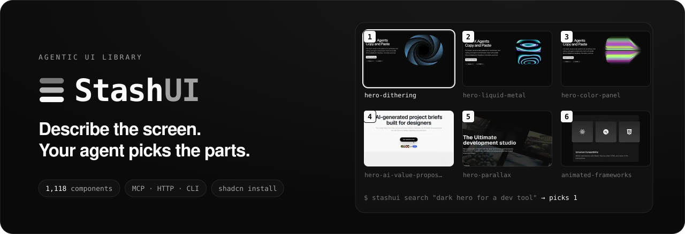
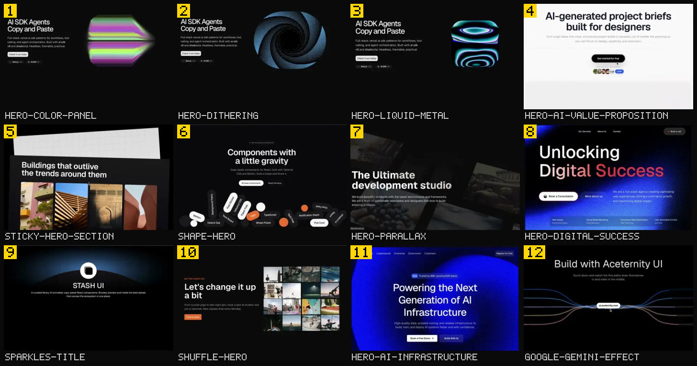
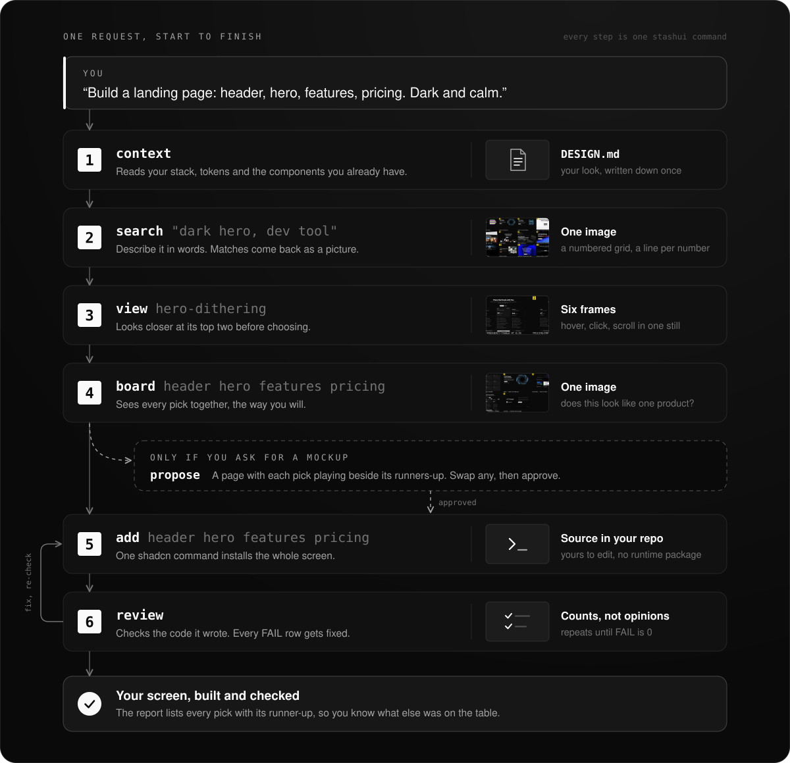
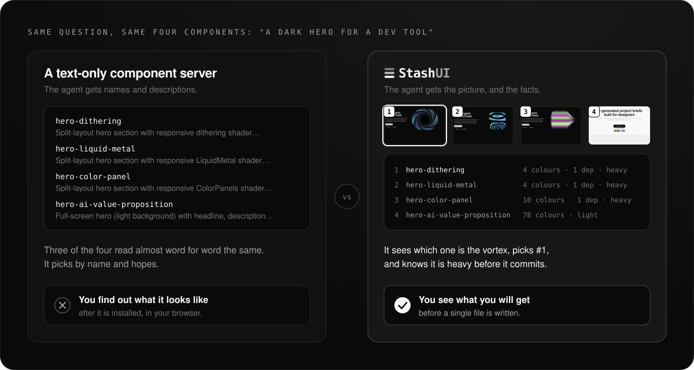
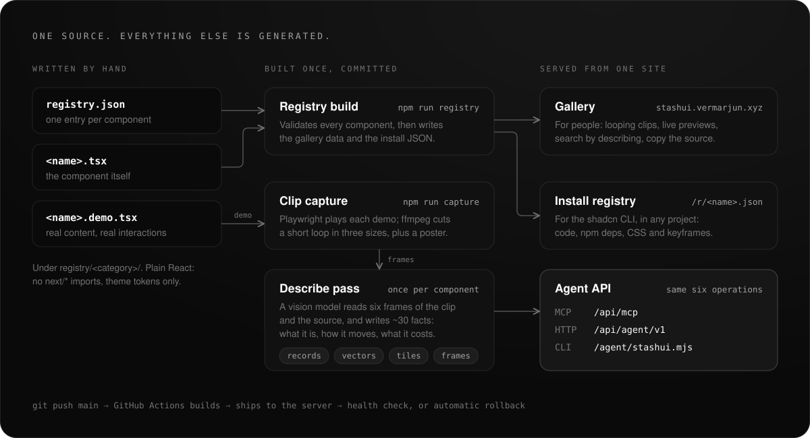

<p align="center">
  <a href="https://stashui.vermarjun.xyz"></a>
</p>

<p align="center">
  <a href="https://stashui.vermarjun.xyz"><b>Gallery</b></a> &nbsp;·&nbsp;
  <a href="#connect-it-to-your-agent"><b>Connect your agent</b></a> &nbsp;·&nbsp;
  <a href="#how-a-screen-gets-built"><b>How it works</b></a> &nbsp;·&nbsp;
  <a href="agent/SPEC.md"><b>Protocol</b></a>
</p>

StashUI is a library of 1,118 hand-picked React components, built so a coding agent can **see** them before it uses them. Your agent describes what it needs and gets back a picture of real matches, numbered. It picks by looking, checks that its picks fit together, and installs the whole screen with one shadcn command. The code lands in your repo and is yours.

## Connect it to your agent

StashUI is a remote MCP server. There's nothing to install, and you don't need an account or an API key:

```text
https://stashui.vermarjun.xyz/api/mcp
```

Find your client below and run the one thing under it. The first three were tested end to end: they connected, called `search` and got the image back.

#### Claude Code

```bash
claude mcp add --transport http --scope user stashui https://stashui.vermarjun.xyz/api/mcp
```

#### Codex

```bash
codex mcp add stashui --url https://stashui.vermarjun.xyz/api/mcp
```

#### opencode

Add this to `opencode.json` in your project, or to `~/.config/opencode/opencode.json` for every project:

```json
{
  "mcp": {
    "stashui": { "type": "remote", "url": "https://stashui.vermarjun.xyz/api/mcp" }
  }
}
```

#### Cursor

<a href="https://cursor.com/en/install-mcp?name=stashui&config=eyJ1cmwiOiJodHRwczovL3N0YXNodWkudmVybWFyanVuLnh5ei9hcGkvbWNwIn0="></a>

Or add it to `~/.cursor/mcp.json`:

```json
{ "mcpServers": { "stashui": { "url": "https://stashui.vermarjun.xyz/api/mcp" } } }
```

#### VS Code (Copilot agent mode)

<a href="https://insiders.vscode.dev/redirect/mcp/install?name=stashui&config=%7B%22type%22%3A%22http%22%2C%22url%22%3A%22https%3A%2F%2Fstashui.vermarjun.xyz%2Fapi%2Fmcp%22%7D"></a>

Or run:

```bash
code --add-mcp '{"name":"stashui","type":"http","url":"https://stashui.vermarjun.xyz/api/mcp"}'
```

#### Gemini CLI

```bash
gemini mcp add --transport http stashui https://stashui.vermarjun.xyz/api/mcp
```

#### Windsurf

Add it to `~/.codeium/windsurf/mcp_config.json`:

```json
{ "mcpServers": { "stashui": { "serverUrl": "https://stashui.vermarjun.xyz/api/mcp" } } }
```

#### Claude Desktop and claude.ai

Go to **Settings → Connectors → Add custom connector**. Name it `StashUI`, paste the URL and leave authentication empty.

#### ChatGPT

Go to **Settings → Apps & Connectors → Advanced** and turn on developer mode. Then create a connector with the URL and no authentication.

#### Anything else

Point any client that speaks MCP over Streamable HTTP at the URL. It needs no headers and no auth.

### Check it worked

Ask your agent:

```text
Use StashUI to show me three pricing sections.
```

You should get back a numbered image of real pricing sections, with one line of facts per number.

### Then ask for UI the way you already do

```text
Build a landing page for my app: header, hero, features, pricing, footer.
Dark and calm. Show me a mockup before you change anything.
```

Leave off the last sentence and it goes straight to building.

### Optional: add the skills for better results

The MCP server gives your agent the tools. The skills give it the method: plan the page, search, look closer, check that the picks fit together, install, then review. They add a mockup step and a review loop. If your agent has a shell, paste this into it once:

```text
Set up StashUI for me: follow https://stashui.vermarjun.xyz/setup.md
```

The agent runs one command, the same on macOS, Linux and Windows. It puts a one-file CLI and three skills in your home folder, and your project doesn't change. You can use the skills, the MCP server, or both.

## What your agent actually sees

This is the real image `stashui search "hero section for a dev tool, dark, with motion"` returns. Nothing here was mocked up for the README.

<p align="center"></p>

Each number comes with one line of facts, so the agent knows what a pick costs before it commits:

```text
 2  hero-dithering     Headline and button beside a pixelated blue vortex that never stops turning.
                       (always/hover · 1 deps · 4 colours · heavy · q4)
 6  shape-hero         Labelled pills and dots fall and pile up under a headline like loose objects.
                       (viewport/drag · 0 deps · 32 colours · q5)
```

Then it looks closer, and checks the set:

<p align="center"></p>

**`view`** shows six frames of one component in motion. You can see the monthly/yearly switch and the prices rolling, in a single still image.

<p align="center"></p>

**`board`** puts every pick on one sheet. For this set it also warned that the picks use two accent hues, so they need recolouring to your tokens before the page looks like one product.

## How a screen gets built

<p align="center"></p>

The skills tell the agent to follow these steps. Each step is one CLI command, and the same operation is available over MCP and HTTP.

## Why it is different

<p align="center"></p>

- **It searches by meaning.** You can search for "a pricing table with a monthly/yearly toggle" and get pricing tables with toggles back. A vision model watched every component once and wrote down what it is and how it moves. Search runs over those descriptions.
- **It is curated.** Every component was reviewed and scored by a person, so weaker components and near-duplicates are archived and don't come up.
- **It costs you nothing at runtime.** Installs go through the shadcn CLI, so you get source code in your repo. There is no StashUI package and no lock-in.

## For people: the gallery

<p align="center"><a href="https://stashui.vermarjun.xyz"></a></p>

Browse by use case, press <kbd>⌘</kbd> <kbd>K</kbd> and describe what you want, or open any component to try the real thing at phone, tablet and desktop width. Every component page has its install command:

```bash
npx shadcn@latest add https://stashui.vermarjun.xyz/r/shimmer-button.json
```

## Under the hood

<p align="center"></p>

```bash
git clone https://github.com/vermarjun/StashUI.git && cd StashUI
npm install
npm run dev          # gallery on http://localhost:3000
npm run agent:dev    # agent API alone on :4317
```

| Command | What it does |
| --- | --- |
| `npm run registry` | Rebuild gallery data and install JSON after a registry change |
| `npm run capture -- <name>` | Record a component's preview clip |
| `npm run agent` | Rebuild everything agents are served (`public/agent/`) |
| `npm run agent:test` | Test the agent API, CLI, MCP endpoint and skills |

To add a component, put `<name>.tsx` and a `<name>.demo.tsx` that shows real content under `registry/<category>/`, add an entry to `registry.json`, then run `npm run registry`. Components have to work in plain React as well as Next.js: no `next/*` imports, and theme tokens instead of hex colours.

## Read more

- [agent/README.md](agent/README.md) explains how the agent side is built and why each decision was made.
- [agent/SPEC.md](agent/SPEC.md) is the protocol: six operations over MCP, HTTP and the CLI.
- [public/setup.md](public/setup.md) is the exact document your agent follows during setup.

---

<sub>Built on <a href="https://ui.shadcn.com">shadcn</a>, React, Next.js, Tailwind and Radix, with components by many authors, each credited in the gallery. <a href="LICENSE">MIT</a>.</sub>
